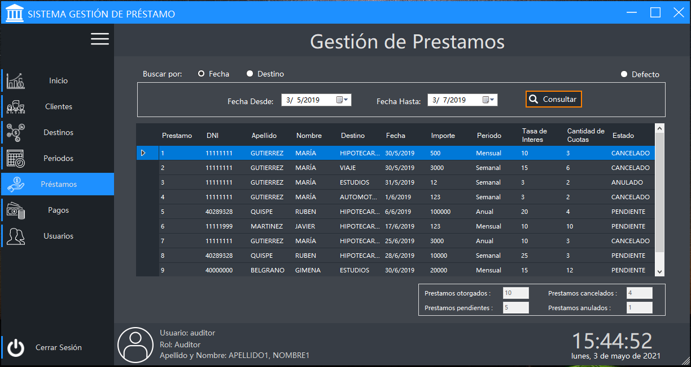
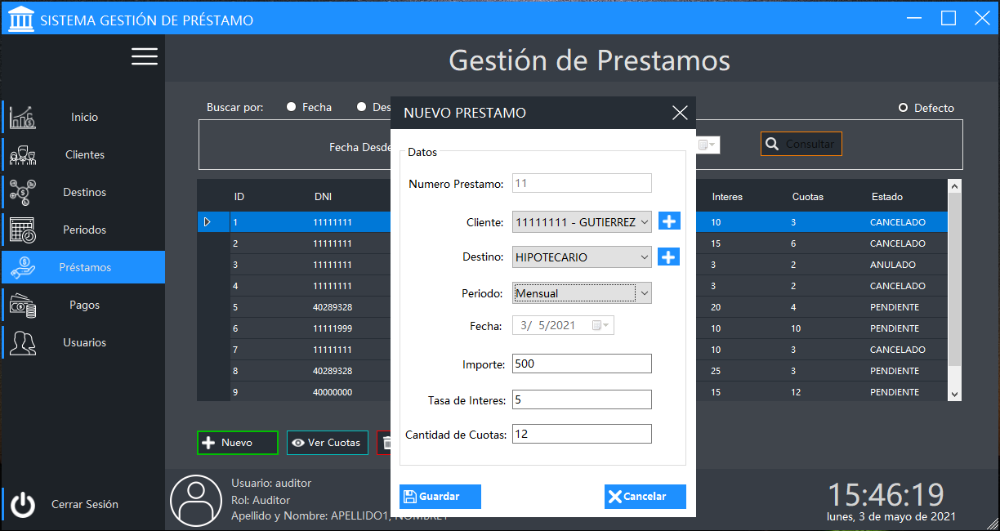
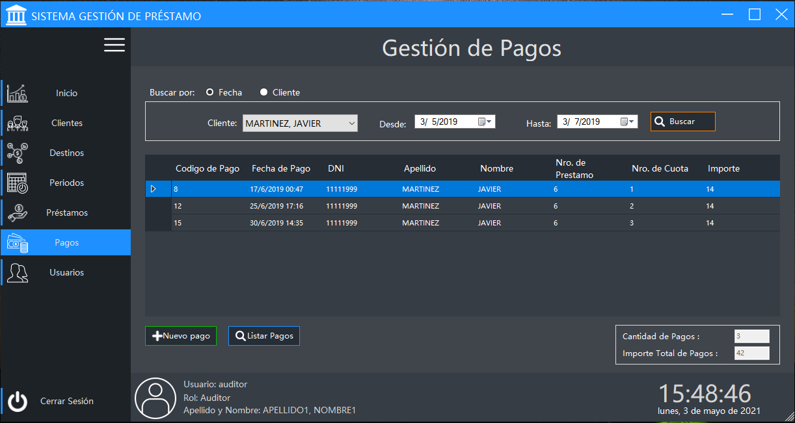
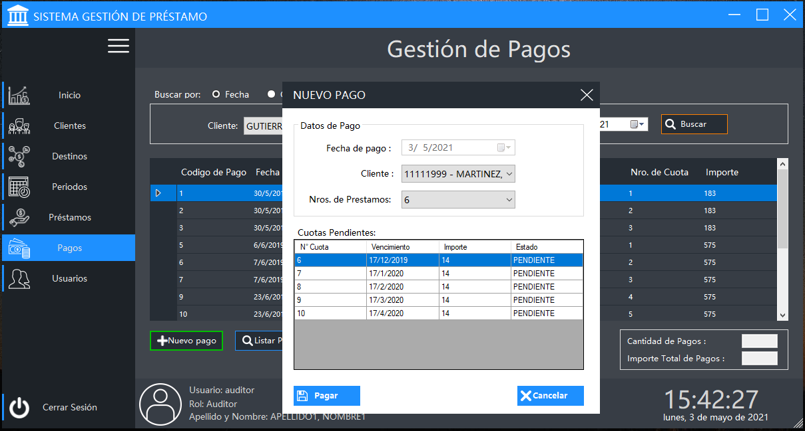
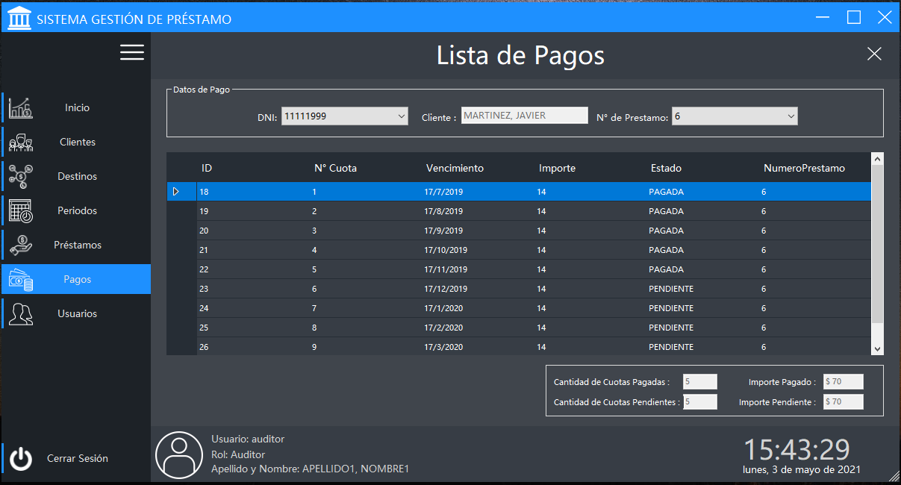

# Proyecto Final - Sistema de gestión de Prestamos
Proyecto Desktop Implementado con .NET: C#, Window Forms y ADO.NET. 
Para la materia Laboratorio de Programación Orientada a Objetos - UNJu, Año 2019

## Capturas de pantallas de algunas interfaces del sistema

## Prestamos - Listado general

## Prestamos - Nuevo

## Pagos - Listado general

## Pagos - Nuevo

## Pagos - Listados de pagos por cliente

